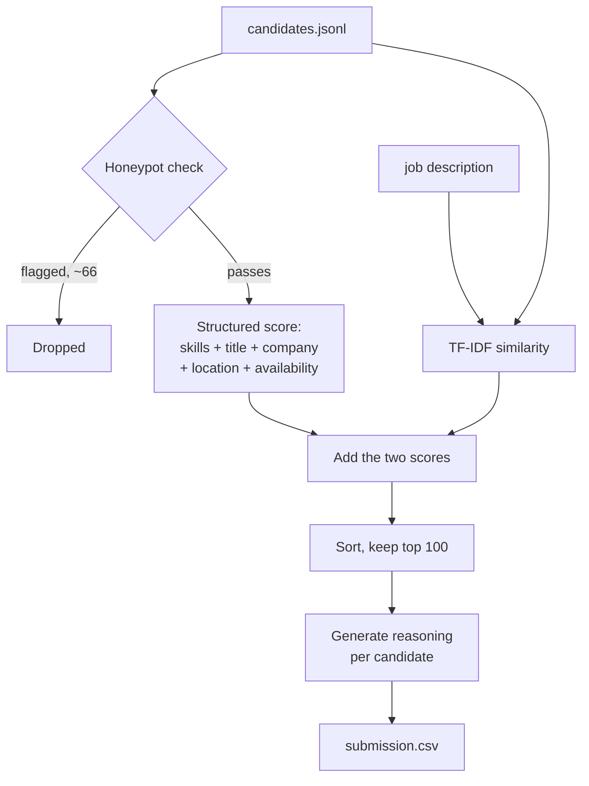

# Redrob Intelligent Candidate Ranker

This is our submission for Redrob's Data & AI Challenge: given a pool of
100,000 candidate profiles and a job description for a Senior AI Engineer
role, produce a ranked shortlist of the top 100, with a short reason for
each pick.

`rank.py` does the actual ranking. `app.py` is a small Gradio UI on top of
it. Everything else is reference data, generated output, or documentation -
see "What's in this repo" at the bottom for a file-by-file breakdown.

## Quick start

```bash
pip install -r requirements.txt
python app.py
```

This opens a local page (usually `http://127.0.0.1:7860`) where you can
upload a candidates file, run the ranker, and download the results as a CSV.
It works on the full 100,000-candidate file too - that takes about a minute.
If you don't upload anything, it runs on a small bundled sample so the page
isn't empty.

That covers most uses. The next section is for running things directly from
the command line instead.

## Command-line usage

```bash
python rank.py --candidates candidates.jsonl --out submission.csv
python validate_submission.py submission.csv
```

`candidates.jsonl` isn't in this repo (it's ~465MB, provided separately by
the organizers). `rank.py` also reads `.jsonl.gz` and the original challenge
`.zip` directly, so you can point it at whichever form you downloaded:

```bash
python rank.py --candidates candidates.jsonl.gz --out submission.csv
python rank.py --candidates "India_runs_data_and_ai_challenge.zip" --out submission.csv
```

On a single CPU core with no GPU, ranking all 100,000 candidates takes
around a minute and peaks at about 3.5GB RAM. `validate_submission.py` is
the organizers' checker, included here so it's not a separate download.

## How rank.py works

Roughly five steps, all in one pass over the candidate file:

1. **Honeypot filter.** A handful of profiles in the dataset are
   structurally impossible (more on this below). These get dropped before
   any scoring happens, so they can never end up in the output.
2. **Structured scoring.** Every remaining candidate gets a score built from
   five things: their skills, their job title, their company/career history,
   their location, and a set of behavioral signals (how recently they were
   active, whether they're open to work, notice period, etc).
3. **TF-IDF similarity.** Each candidate's summary, work history, and skill
   list are compared against the job description text using TF-IDF cosine
   similarity. This adds a lexical signal on top of the structured score.
4. **Combine and sort.** The structured score and the TF-IDF score are added
   together, candidates are sorted by that total, and the top 100 are kept.
5. **Reasoning.** For each of the top 100, a short explanation is generated
   from the same features used for scoring, so nothing in the output is made
   up - if the reasoning mentions a skill or a company, it's because that
   field is actually in the candidate's record.



The numbers behind step 2 (which skills matter, which titles count, etc.)
came from looking at the actual 100K-candidate file before writing any
scoring code. `notebooks/01_eda_full_pool.py` is that analysis, and
`reference_data.py` is where the results live as lookup tables.

## What the data actually looks like

A few things stood out when going through the full candidate pool that
shaped how the scoring works.

### Job titles

There are exactly 47 distinct values for `current_title` across all 100K
candidates, and they split cleanly into five groups by both how often they
appear and how relevant they are to an AI engineering role.

| Group | Examples | Roughly how many | Score |
|---|---|---|---|
| Off-target | Business Analyst, HR Manager, Accountant, Marketing Manager, Sales Executive, Civil Engineer, Graphic Designer, etc. | ~68,800 | -20 |
| General tech | Software Engineer, Full Stack Developer, DevOps Engineer, QA Engineer, etc. | ~25,700 | 0 |
| Data-adjacent | Data Engineer, Data Analyst, Backend Engineer, Senior Software Engineer | ~4,280 | +3 |
| AI/ML, broad | ML Engineer, Data Scientist, Computer Vision Engineer, AI Research Engineer, etc. | ~1,000 | +8 |
| AI/ML, senior/narrow | Search Engineer, NLP Engineer, Senior/Staff/Lead ML or AI Engineer, Senior Applied Scientist, Recommendation Systems Engineer, etc. | ~179 | +12 |

The job description itself gives an example of a candidate with every AI
buzzword in their skills list but a "Marketing Manager" title, and says
that's not a fit no matter how good the skills look. The -20 penalty on the
off-target group is built so a high skill score genuinely can't make up for
that.

### Skills

133 distinct skill names show up across the dataset, and they fall into four
bands by frequency:

- About 62 skills show up in roughly 12% of profiles each - things like
  React, SQL, Excel, Docker, Accounting. Generic, present everywhere,
  contribute nothing to the score (weight 0).
- About 35 skills show up in roughly 5% of profiles - common AI/ML
  buzzwords like Embeddings, RAG, Pinecone, LangChain, Computer Vision,
  YOLO. These get small weights (1-5), and CV/speech-specific ones get the
  bottom of that range since the job description explicitly says
  CV/speech without NLP isn't a match.
- About 20 skills show up in roughly 1.3% of profiles - Python, NLP,
  PyTorch, the named vector databases (Qdrant, Weaviate, Milvus, pgvector,
  OpenSearch, Elasticsearch), BM25, Learning to Rank, LoRA/QLoRA/PEFT. That
  1.3% lines up almost exactly with the ~1,180 candidates whose *title* is
  an AI/ML role, which is a good sign these are the skills people who
  actually do this work tend to list. Weighted 6-10.
- 14 skills show up only 1-7 times total in the whole 100K-candidate file -
  things like "Search Infrastructure", "Ranking Systems", "Indexing
  Algorithms", "Open-source ML libraries". These are weighted highest
  (13-14) and turn out to belong almost entirely to one specific group of
  candidates (see Results below).

### Companies

Companies in `current_company` and career history split into a few buckets:
AI-native Indian startups (Sarvam AI, Krutrim, Niramai, Haptik, Yellow.ai,
and similar - score 8), FAANG-type companies (Google, Meta, Amazon, etc. -
score 7), well-known Indian product companies (Razorpay, CRED, Flipkart,
Swiggy, etc. - score 5), and the consulting firms the job description
specifically calls out (TCS, Infosys, Wipro, Accenture, Cognizant, Capgemini,
Tech Mahindra, Mphasis, HCL, Mindtree - score 0). There's also a set of eight
generic placeholder companies (Wayne Enterprises, Hooli, Pied Piper, Stark
Industries, etc.) that show up thousands of times each across every title
type and clearly carry no signal either way.

If a candidate's entire career history (current job plus everything before
it) is inside that consulting-firm list, they take an additional -8 penalty,
matching the job description's note that consulting-only candidates aren't a
fit. If they're currently at a consulting firm but have product-company
history, no penalty applies - the JD only disqualifies people whose *whole*
career has been consulting.

## Honeypots

The job description mentions the dataset contains "subtly impossible"
profiles designed to catch people who only do keyword matching. Three checks
catch these:

- **A.** Three or more skills are listed as `expert` proficiency with
  `duration_months: 0`. Across the whole dataset, the distribution of this
  count is `{0: 99979, 3: 8, 4: 5, 5: 8}` - basically nobody has 1 or 2, only
  a clearly designed subset has 3 or more.
- **B.** The candidate's total career history duration adds up to less than
  40% of their stated `years_of_experience`. For example, someone claiming
  14 years of experience with a single 56-month job on record.
- **C.** The opposite: career history adds up to more than 160% of stated
  experience. Someone claiming 3 years but with jobs that sum to over 5
  years.

These three checks flag 66 candidates total, with almost no overlap between
them, which is a strong sign they're catching a deliberately-placed group
rather than false positives in normal data. B and C in particular catch the
kind of thing the job description describes as an example: "8 years of
experience at a company founded 3 years ago" - the years on the resume don't
reconcile with the timeline, even if the title and company look great on
paper. A few of the flagged profiles do have great-looking titles (e.g. a
"Machine Learning Engineer" at a well-known company) - the timeline is what
gives them away, not the skills or title.

Flagged candidates are removed before scoring, so the honeypot rate in the
final output is 0%.

## The scoring formula

```
score = skill_score
      + title_score
      + company_score
      + consulting_penalty
      + experience_fit_score
      + location_score
      + availability_score
      + tfidf_bonus
```

- **skill_score** sums up `weight(skill) x proficiency_multiplier x
  duration_multiplier` across all of a candidate's skills, using the weights
  from the table above. Proficiency multipliers are 1.0/0.75/0.5/0.25 for
  expert/advanced/intermediate/beginner. Duration multiplier ramps from 0.7
  at 0 months to 1.0 at 24+ months, so a skill someone just started claiming
  counts a bit less than one they've used for years.
- **title_score** and **company_score** come straight from the tables above.
- **experience_fit_score** peaks for candidates with 6-8 years of
  experience (the job description's stated sweet spot), tapering off on
  either side and hitting 0 below ~3 years or above ~12.
- **location_score** is highest for Noida/Pune (explicitly preferred in the
  JD), a bit lower for Delhi NCR/Mumbai/Hyderabad (explicitly welcomed), and
  lower still for the rest of India or outside it, with a small bump if the
  candidate is flagged as willing to relocate.
- **availability_score** combines how recently the candidate was active,
  whether they're open to work, recruiter response rate, notice period, and
  interview completion rate. The job description gives an example of
  down-weighting someone who looks perfect on paper but hasn't logged in for
  six months and has a 5% response rate - this is where that happens. A
  response rate under 10% is a -5, for instance.
- **tfidf_bonus** is described below.

### Why TF-IDF and not a sentence embedding model

Before picking a method for the lexical/semantic part of the score, we
looked at how varied the free-text fields actually are. Across 20,000
sampled candidates, `career_history[].description` only takes 42 distinct
values - the dataset reuses a small library of template descriptions with
numbers swapped in, rather than writing something unique per candidate. A
sentence embedding model on this data would mostly be re-discovering which
of ~40 templates a candidate matches, which a TF-IDF cosine similarity
already does, without needing to download a model or use any GPU time -
relevant given the "no network during ranking" rule.

So: `TfidfVectorizer(max_features=4000, ngram_range=(1,2))` over each
candidate's summary, career descriptions, and skill names, compared against
a condensed version of the job description (`reference_data.JD_TEXT`). The
similarity score is scaled to roughly 0-10 and added to the structured
score.

If this were running on a dataset with genuinely unique candidate summaries,
swapping this for precomputed sentence embeddings (e.g. `all-MiniLM-L6-v2`)
would be a small change - the `tfidf_bonus` slot in the formula above is
where it'd go.

## Reasoning text

For each of the top 100, `generate_reasoning()` builds a sentence or two
from the same data used for scoring. It picks out the candidate's strongest
relevant skill, their company tier if it's notable, whether their experience
falls in the target range, and any concerns (title not AI/ML-focused,
location outside the preferred area, low response rate, long notice period,
consulting-only career, no retrieval/ranking skills at all).

For candidates with no flagged concerns, the reasoning ends with a line
tying their strongest skill back to a specific part of the job description -
for example, someone with expert-level Qdrant experience gets a line about
matching the JD's vector-database requirement specifically, not just "good
fit".

Phrasing and sentence structure vary per candidate (based on a hash of their
ID), so the 100 reasoning lines don't all read like the same template filled
in 100 times, while still being built entirely from real fields in that
candidate's record.

## Results

Running the full pipeline on all 100,000 candidates: 66 are flagged as
honeypots and excluded, leaving 99,934 to be scored and ranked.

Earlier, the skill table mentioned 14 skills that show up only 1-7 times
total across the whole dataset. It turns out exactly 8 candidates hold most
of these skills, and all 8 share an identical opening line in their summary:
*"Senior engineer who has spent the last several years building systems that
connect users with relevant information at scale..."* - titles like Senior
AI Engineer, Staff ML Engineer, Senior Applied Scientist, at companies
including Meta, LinkedIn, Adobe, Salesforce, Sarvam AI, and Niramai.

With the scoring above, **all 8 of these candidates land at ranks 1-8** of
the output. Ranks 9-100 are all candidates whose title falls in the AI/ML
senior/narrow band and who have at least one core retrieval, ranking, or
vector-database skill at advanced or expert level.

The output passes `validate_submission.py`, all 100 reasoning strings are
unique, and scores are strictly decreasing from rank 1 to 100.

## What this doesn't handle

A few things worth knowing about if extending this:

- The TF-IDF approach works well *for this dataset* because of the templated
  text, as explained above. On a dataset with genuinely unique candidate
  writing, a real embedding model would likely do better.
- The scoring is a hand-tuned weighted sum rather than a learned model. It's
  easy to reason about and adjust, but a learning-to-rank model trained on
  these same features (or on real recruiter feedback, if that existed) would
  probably do better at the margins.
- The job description flags candidates whose background is computer
  vision/speech without NLP exposure as a poor fit. In practice, almost all
  AI/ML-titled candidates in this dataset already have an NLP-adjacent skill,
  so this distinction barely affects the current output - but the skill
  weights (CV/speech weighted much lower than NLP/retrieval) would matter
  more on a population where that split is more common.

## What's in this repo

**rank.py**
The ranking pipeline. Reads a candidates file, runs the honeypot filter,
scores everyone, and writes the ranked CSV. Used both directly (Command-line
usage) and by `app.py` under the hood.

**reference_data.py**
The lookup tables `rank.py` scores against - skill, title, company, and
location weights, plus the condensed job description text used for the
TF-IDF comparison. All of it comes from the EDA in
`notebooks/01_eda_full_pool.py`.

**app.py**
The Gradio UI from Quick start. Also the entry point if this repo is run as
a HuggingFace Space - the YAML block at the very top of this file is that
Space's configuration.

**sample_candidates.jsonl**
A 58-candidate sample `app.py` loads by default, so the page has something
to show before you upload anything.

**validate_submission.py**
The organizers' format checker for `submission.csv`, included here so it's
not a separate download.

**requirements.txt**
Covers both `rank.py` (scikit-learn, numpy, scipy) and `app.py` (gradio,
pandas).

**submission.csv**
`rank.py`'s output on the full 100,000-candidate pool - this is the actual
submission.

**submission_metadata.yaml**
Team info and a methodology summary for the submission portal.

**notebooks/01_eda_full_pool.py** / **01_eda_output.txt**
The analysis behind every number in "What the data actually looks like" and
"Honeypots" above. Run the script against `candidates.jsonl` to reproduce
the output file.

**notebooks/02_build_sandbox_sample.py**
How `sample_candidates.jsonl` was put together - picks the 8 "ideal"
candidates, a few honeypots that look good on the surface, and a mix of
relevant/irrelevant titles from the full pool.

---

Built with ❤️ for the Redrob Data & AI Challenge, part of India.Runs.